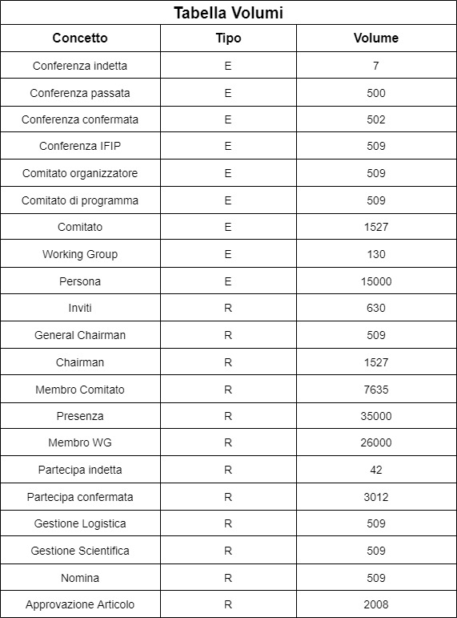
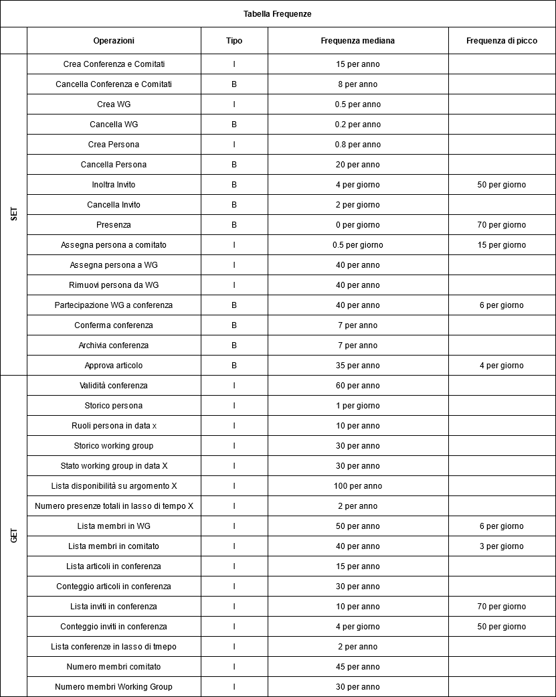
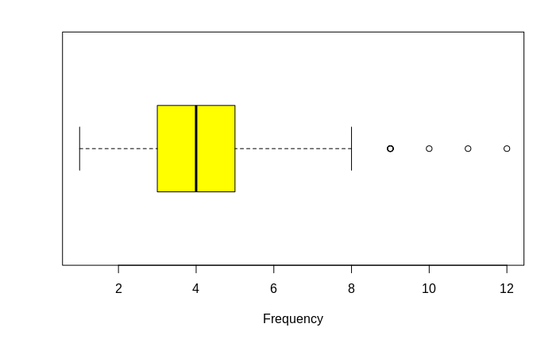
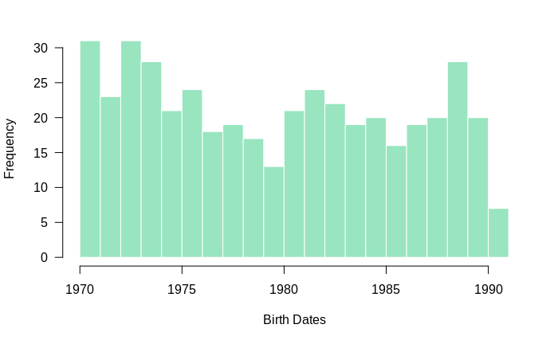
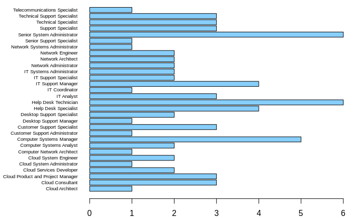
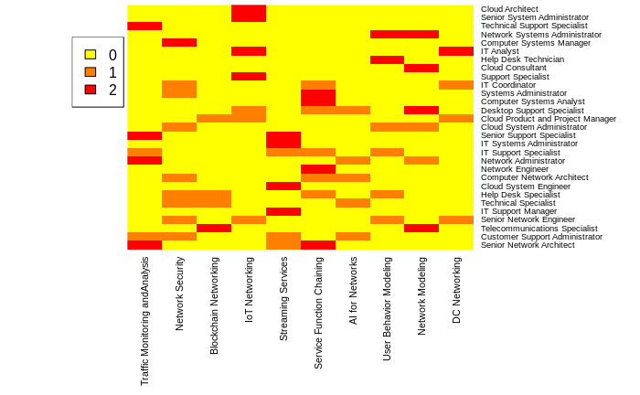

# Introduzione

Il progetto riguarda la creazione di un database di supporto all'organizzazione delle working conferences del IFIP.
La consegna del problema è la seguente:

“Si vuole progettare una base di dati di supporto all'organizzazione delle working conferences dell'IFIP (International Federation for Information Processing). Una IFIP Conference è una conferenza internazionale intesa a riunire esperti di tutti i paesi aderenti al IFIP per discutere problemi che interessano uno o più IFIP Working Group. Ogni Working Group opera sotto gli auspici di un Technical Committee costituito dai rappresentanti nazionali dei paesi aderenti al IFIP.
Alla conferenza possono partecipare solo persone che hanno ricevuto un invito. L'invito è inviato a tutti i membri dei Working Groups e Technical Committees interessati. Il numero delle persone che parteciperanno ai lavori deve essere superiore ad una soglia minima, per garantire la copertura dei costi, ed inferiore ad una soglia massima, per non superare le capacità ricettive delle strutture.
La conferenza è organizzata da due comitati: il Comitato di Programma e il Comitato Organizzatore. Il primo cura gli aspetti scientifici della conferenza, nominando il Comitato dei Revisori, che esaminerà gli articolo sottomessi alla conferenza e deciderà quali articoli accettare, rispettando il vincolo sul numero massimo prestabilito. Il secondo cura gli aspetti finanziari e logistici, gli inviti e la pubblicità. Ogni comitato è costituito da esperti ed è previsto un Chairman per ogni comitato e un General Chairman per la conferenza. Tutti i comitati lavorano utilizzando dati comuni che vanno raccolti ed elaborati in modo consistente.
Si definisca uno schema Entità-Relazioni che descriva il contenuto informativo del sistema, illustrando con chiarezza le eventuali assunzioni fatte. Lo schema dovrà essere completato con attributi ragionevoli per ciascuna entità (identificando le possibili chiavi) e relazione. Vanno specificati accuratamente i vincoli di cardinalità e partecipazione di ciascuna relazione.”

Abbiamo svolto il progetto in varie fasi:
- Analisi dei requisiti
- Progettazione concettuale
- Progettazione logica
- Progettazione fisica
- Implementazione
- Analisi dei dati

# Glossario

- Conferenza: Singola conferenza IFIP.
- Comitato: Comitato generico. Composto da almeno un membro e con esattamente un Chairman.
- Comitato Tecnico: Comitato assegnato ad un Working Group in una conferenza.
- Comitato di Programma: Gestisce aspetti scientifici della conferenza. Nomina comitato dei revisori.
- Comitato Organizzatore: Gestisce aspetti logistici finanziari. Inoltra gli inviti.
- Comitato dei Revisori: Approva o respinge articoli sottomessi alla conferenza.
- Working Group: Gruppo interessato ad una o più specifiche conferenze.
- Persona: Individuo generico.
- Rappresentante: Membro di un Working Group che rappresenta una nazione.
- Chairman: Individuo a capo di un comitato.
- General Chairman: Individuo a capo di una conferenza.
- Invitato: Individuo invitato ad una conferenza.
- Articolo: Articolo sottomesso o approvato ad una o più conferenze. C'è un limite massimo di articoli approvabili per ogni conferenza.

# Analisi dei requisiti

- Analizzando il testo della consegna ed espandendo utilizzando risorse in rete abbiamo riconosciuto i seguenti fondamentali requisiti:
- Il database è atto alla gestione di conferenze IFIP.
- Le conferenze trattano problemi di interesse per uno o più Working Groups.
- A ogni Working Group è assegnato un Comitato Tecnico.
- I comitati tecnici sono 13 e si dividono per argomenti trattati.
- Un Comitato Tecnico è composto da rappresentanti nazionali.
- Alla conferenza partecipano solo e soltanto gli invitati.
- Ogni membro di un comitato lla conferenza riceve l'invito.
- Il numero dei partecipanti a una conferenza deve rispettare requisiti minimi e massimi.
- Il Comitato di Programma gestisce gli aspetti scientifici della conferenza.
- Il Comitato Organizzatore si occupa degli aspetti logistici della conferenza.
- Il Comitato Organizzatore inoltra gli inviti.
- Il Comitato di Programma nomina il Comitato dei Revisori.
- Il Comitato dei Revisori approva o respinge gli articoli sottomessi alla conferenza.
- Gli articoli sottomessi non ancora approvati non vengono modellati nel database.
- Non possono essere accettati più di massimo di articoli in una data conferenza.
- Ogni comitato (tranne quelli tecnici) ha un Chairman.
- Ogni conferenza ha un General Chairman.
- I comitati (tranne quelli tecnici) sono relativi a una singola conferenza.
- Un individuo può far parte di più di un comitato allo stesso tempo.
- Un individuo può far parte di più Working Groups o comitati tecnici allo stesso tempo.
- Un individuo può essere invitato anche se non appartiene a un comitato.
- E' necessario modellare uno storico dei comitati tecnici.
- Le conferenze vanno generalizzate in base al loro status (indetta, fissata e passata).
- Una persona non può fare parte di un Comitato Tecnico senza fare parte di uno dei suoi Working Group.
- Un Working Group può non avere partecipanti come alla creazione o quando viene spopolato.
- I comitati di conferenza a essa legati vengono creati prima di quest'ultima.
- I comitati di conferenza vengono creati già con il Chairman assegnato.
- La conferenza viene creata con il General Chairman assegnato.

# Progettazione concettuale

## Diagramma E-R

Tenendo di conto i requisiti, dopo qualche iterazione siamo giunti al seguente diagramma E-R

\*immagine\*

# Progettazione logica

Seguono rispettivamente la tabella volumi e la tabella delle frequenze, contenenti dati arbitrari ma verosimili.

## Tabella volumi



## Tabella frequenze



## Analisi delle ridondanze

Utilizzando le precedenti tabelle abbiamo analizzato la possibilità di utilizzare ridondanze per rappresentare alcuni dati e abbiamo ottenuto i seguenti risultati:

* **Da mantenere:**
  - Il numero di membri in un working group
  - Il conteggio degli articoli approvati per la conferenza
  - Il numero di membri in un comitato

* **Da eliminare:**
  - Il numero di presenze in conferenze passate
  - La validità delle conferenza
  - Il conteggio degli inviti alla conferenza

Per brevità riportiamo il processo di analisi di solo uno di questi dati, in particolare il numero di membri in un comitato.

### Analisi numero di membri in un comitato:
Seguono le operazioni che interagiscono con il numero di membri in un comitato con la loro tabella degli accessi e frequenza di utilizzo, divise nei due casi (presenza e assenza di ridondanza).

#### Con ridondanza:

\* analisi con schemini \*

#### Senza ridondanza:

\* analisi con schemini \*

Come si evince dall’analisi, mantenere la ridondanza riduce gli accessi giornalieri di oltre 10 volte.

## Schema E-R ristrutturato

## Schema relazionale

# Progettazione fisica

Abbiamo usato Postresql per progettare fisicamente il database, riportiamo alcuni frammenti di codice rilevanti

Visto che le conferenze di distinguono in tre stati abbiamo deciso di creare un tipo di dati dedicato

```sql
CREATE TYPE STATO_CONFERENZA AS ENUM
(
'INDETTA', 'FISSATA', 'PASSATA'
);
```

La tabella centrale e più importante del database è "conferenza", qui sotto riportiamo il codice per crearla

```sql
CREATE TABLE conferenze.conferenza
(
  data date NOT NULL,
  argomento character varying(50) NOT NULL,
  stato stato_conferenza NOT NULL,
  min_iscritti smallint NOT NULL,
  max_iscritti smallint NOT NULL,
  conclusioni character varying(100),
  termine_conferenza date,
  luogo character varying(100),
  numero_articoli smallint DEFAULT 0,
  general_chairman character(16),
  numero_membri_org smallint DEFAULT 0,
  chairman_org character(16),
  numero_membri_prog smallint DEFAULT 0,
  chairman_prog character(16),
  numero_membri_rev smallint DEFAULT 0,
  chairman_rev character(16),
  CONSTRAINT conferenza_pkey PRIMARY KEY (data, argomento),
  CONSTRAINT conferenza_chairman_org_fkey FOREIGN KEY (chairman_org, data, argomento)
  	REFERENCES conferenze.membro_org (cf, data_conferenza, argomento_conferenza) MATCH FULL
  	ON UPDATE CASCADE ON DELETE SET NULL
            DEFERRABLE INITIALLY DEFERRED,
  CONSTRAINT conferenza_chairman_prog_fkey FOREIGN KEY (chairman_prog, data, argomento)
  	REFERENCES conferenze.membro_prog (cf, data_conferenza, argomento_conferenza) MATCH FULL
  	ON UPDATE CASCADE ON DELETE SET NULL
            DEFERRABLE INITIALLY DEFERRED,
  CONSTRAINT conferenza_chairman_rev_fkey FOREIGN KEY (chairman_rev, data, argomento)
  	REFERENCES conferenze.membro_rev (cf, data_conferenza, argomento_conferenza) MATCH FULL
  	ON UPDATE CASCADE ON DELETE SET NULL
            DEFERRABLE INITIALLY DEFERRED,
  CONSTRAINT conferenza_general_chairman_fkey FOREIGN KEY (general_chairman)
  	REFERENCES conferenze.persona (cf) MATCH SIMPLE
  	ON UPDATE CASCADE ON DELETE SET NULL
            DEFERRABLE INITIALLY DEFERRED
);
```

La tabella necessita di diversi constraint aggiuntivi, mostriamo quelli che abbiamo messo per controllare la correttezza della conferenza in base al suo stato

```sql
ALTER TABLE conferenze.conferenza
ADD CONSTRAINT controlla_indetta
CHECK (
  	termine_conferenza is not NULL
	OR stato != 'INDETTA'
);

ALTER TABLE conferenze.conferenza
ADD CONSTRAINT controlla_fissata
CHECK (
	(
    	data is not null
    	AND luogo is not null
    	AND ( min_iscritti <= conteggio_inviti(data, argomento))
    	AND (conteggio_inviti(data, argomento) <= max_iscritti )
    	AND (numero_articoli > 0)
	) OR stato != 'FISSATA'
);

ALTER TABLE conferenze.conferenza
ADD CONSTRAINT controlla_passata
CHECK (
	(
		conteggio_presenze(data, argomento) > 0
		AND conclusioni is not null
		AND luogo is not null
		AND data is not null
		AND numero_articoli > 0
	) OR stato != ’PASSATA’
);
```

Come si evince dal codice sopra riportato, il constraint "controlla_fissata" necessita della funzione "conteggio_inviti" che riportiamo qui sotto.   
Riportiamo inoltre i trigger utilizzati per mantenere l'attributo ridondante "numero_articoli", anche esso utilizzato nello stesso constraint

```sql
CREATE OR REPLACE FUNCTION conteggio_inviti( data date, arg character varying(50) )
RETURNS smallint
LANGUAGE plpgsql AS
$$
	declare
		n smallint;
	begin
		select count(*) into n from conferenze.invito i
		where i.data_conferenza = data AND i.argomento_conferenza = arg;
		return n;
	end;
$$;
```

```sql
CREATE CONSTRAINT TRIGGER aggiunta_articolo
after insert
ON conferenze.approvazione_articolo
DEFERRABLE
FOR EACH row
EXECUTE PROCEDURE aggiunto_articolo();

CREATE OR REPLACE FUNCTION aggiunto_articolo()
RETURNS trigger
LANGUAGE plpgsql AS
$$
	begin
		UPDATE conferenze.conferenza
		SET  numero_articoli =  numero_articoli + 1
		WHERE conferenza.data = new.data_conferenza 
    AND conferenza.argomento = new.argomento_conferenza;
    
    return new;
	end;
$$; 
```

# Implementazione

Tramite R abbiamo generato dati casuali e semi-plausibili per popolare il database, riportiamo alcuni esempi notabili. Il codice mostrato in questa sezione non è quello originariamente usato da noi (in quanto è andato perso), ma è una ricostruzione apposita per dimostrare i concetti esplicati nella relazione

### Tabella persona

Una delle prime e più semplici tabelle che abbiamo riempito è stata "persona". Nome e cognome sono estratti casualmente dal [file provveduto dal prof. Della Monica](https://users.dimi.uniud.it/~dario.dellamonica/teaching/19_20_1sem_BDlab/19_20_1sem_BDlab.php) e nella stessa maniera abbiamo estratto casualmente le specializzazioni [da questo documento, a partire da pagina 17](https://networking.ifip.org/images/IFIP_Networking_2020-Booklet.pdf) e le professioni [da questa pagina web](https://www.thebalancecareers.com/list-of-information-technology-it-job-titles-2061498).

Per la data di nascita abbiamo estratto interi casuali, poi convertiti in date

```r
Random_dates <- as.Date(as.POSIXct(sample(0:670204800, size=15000, replace=T), origin="1970-01-01"))
```

Per il codice fiscale invece abbiamo semplicemente utilizzato una libreria chiamata [ifc tools](https://cran.r-project.org/package=ifctools) che genera un codice fiscale plausibile a partire da nome, cognome, sesso, data di nascita e codice catastale

### Tabella conferenza

Per via della loro distinzione in tre stati con diverse caratteristiche popolare la tabella "conferenza" è stato più complesso.

Abbiamo deciso di simulare il ciclo di vita di una conferenza nel database, quindi creandola inizialmente come "indetta" e in seguito convertendola in "fissata" e "passata" in base alle date

Tutte le conferenze, indipendentemente dallo stato, necessitano di un general chairman a loro assegnato. Per sceglierlo abbiamo semplicemente preso il primo invitato a ciascuna conferenza

```r
Conf_join_inviti <- merge(Conferenze, Inviti, by.x = c("argomento", "data"), by.y = ("argomento_conferenza", "data_conferenza"))
Conf_join_inviti_unique <- Conf_join_inviti[!duplicated(Conf_join_inviti[c("argomento", "data")]),]
Conferenze$general_chairman <- Conf_join_inviti_unique$CF
```

In base alle date delle conferenze abbiamo quindi stabilito lo stato in cui si trovassero per poi modificarle di conseguenza, aggiungendo il luogo alle conferenze fissate e luogo, almeno un articolo e conclusioni a quelle passate

```r
Indette <- Conferenze$data_scadenza > Sys.Date()
Passate <- Conferenze$data < Sys.Date()
Fissate <- !Indette & !Passate

Conferenze$luogo[Passate | Fissate] <- sample(Luoghi, size=550, replace=T)
```

# Analisi database

Per l'analisi dati abbiamo scelto di utilizzare 4 grafici diversi: boxplot, histogram, barplot e heatmap

Prima di poter realizzare i grafici dobbiamo però connetterci al database

```{r connection, include=FALSE}
library("RPostgreSQL")
drv <- dbDriver("PostgreSQL")
con <- dbConnect(drv, dbname="conferenze",
                 host="127.0.0.1", port=5432, user="postgres", password="postgres")
```

## Boxplot

Per il boxplot abbiamo deciso di rappresentare la quantità di articoli per ogni conferenza già passata

```{r dati, include=FALSE}
numero_articoli_passate <- dbGetQuery(con, "SELECT numero_articoli 
                                            FROM conferenze.conferenza 
                                            WHERE stato='PASSATA'")
```

```{r}
grafico_articoli <- boxplot(numero_articoli_passate$numero_articoli, horizontal = T, xlab = "Frequency", col = "yellow")
```



## Histogram

Per l'istogramma mostriamo gli anni di nascita di tutti i Network Administrator presenti nel database

```{r include=FALSE}
network_administrator <- dbGetQuery(con, "SELECT data_nascita 
                                          FROM conferenze.persona
                                          WHERE professione='Network Administrator'")
```

Una volta eseguito il query scartiamo giorno e mese dalle date per una visualizzazione delle didascalie più pulita

```{r}
a <- format(as.Date(network_administrator$data_nascita,format="%d/%m/%Y"), "%Y")
a <- as.numeric(a)
hist(a, breaks = 20, col = rgb(0.2,0.8,0.5,0.5), border = F, freq = T, xlim = c(1970,1991), las=1, xlab = "Birth Dates", main = "")
```



## Barplot

Abbiamo invece utilizzato il barplot per mostrare la quantità di professionisti in ciascuna disciplina all'interno di uno specifico Working Group (in questo caso WG-1.1)

```{r include=FALSE}
job_in_wg <- dbGetQuery(con, "SELECT persona.professione 
                              FROM conferenze.persona LEFT JOIN conferenze.membro_wg 
                                                      ON persona.cf = membro_wg.cf 
                              WHERE membro_wg.numero_wg = 1 AND membro_wg.comitato_tecnico = 1")
```

```{r}
par(mar=c(2,9,0,1))
barplot(table(job_in_wg$professione),horiz = T, las=1, cex.names = 0.6, col = "#87CEFA")
```



## Heatmap

L'heatmap rappresenta le distribuzioni di professioni e specializzazioni all'interno di uno specifico Working Group (in questo caso WG-2.5)

```{r include=FALSE}
prof_spec <- dbGetQuery(con, "SELECT persona.professione, persona.specializzazione 
                              FROM conferenze.persona LEFT JOIN conferenze.membro_wg 
                                                      ON persona.cf = membro_wg.cf 
                              WHERE membro_wg.numero_wg = 5 AND membro_wg.comitato_tecnico = 2")

```

Una volta eseguito il query ne abbiamo usato il risultato per riempire una matrice le cui dimensioni sono rispettivamente professione e specializzazione e dove il valore di ciascuna cella rappresenta quante persone abbiano la corrispondente combinazione di professione e specializzazione

```
unique_prof <- unique(prof_spec$professione)
unique_spec <- unique(prof_spec$specializzazione)
m <- matrix(0, nrow = length(unique_prof) ,length(unique_spec))
colnames(m) <- unique_spec
rownames(m) <- unique_prof
for (i in 1:length(prof_spec$professione)) {
  m[prof_spec$professione[i],prof_spec$specializzazione[i]] = m[prof_spec$professione[i],prof_spec$specializzazione[i]]+1
}
```

Infine abbiamo utilizzato la matrice generata per realizzare la heatmap

```
heatmap(m, Rowv = NA, Colv = NA, col= rev(heat.colors(3)), cexCol = 0.8, cexRow = 0.7, margins = c(10,3))
legend(x=0, y=1, legend = c(0, 1, 2), fill = colorRampPalette(rev(heat.colors(3)))(3))
```



