# Introduzione

Il progetto riguarda la creazione di un database di supporto all'organizzazione delle working conferences del IFIP.
La consegna del problema è la seguente:

“Si vuole progettare una base di dati di supporto all'organizzazione delle working conferences dell'IFIP (International Federation for Information Processing). Una IFIP Conference è una conferenza internazionale intesa a riunire esperti di tutti i paesi aderenti al IFIP per discutere problemi che interessano uno o più IFIP Working Group. Ogni Working Group opera sotto gli auspici di un Technical Committee costituito dai rappresentanti nazionali dei paesi aderenti al IFIP.
Alla conferenza possono partecipare solo persone che hanno ricevuto un invito. L'invito è inviato a tutti i membri dei Working Groups e Technical Committees interessati. Il numero delle persone che parteciperanno ai lavori deve essere superiore ad una soglia minima, per garantire la copertura dei costi, ed inferiore ad una soglia massima, per non superare le capacità ricettive delle strutture.
La conferenza è organizzata da due comitati: il Comitato di Programma e il Comitato Organizzatore. Il primo cura gli aspetti scientifici della conferenza, nominando il Comitato dei Revisori, che esaminerà gli articolo sottomessi alla conferenza e deciderà quali articoli accettare, rispettando il vincolo sul numero massimo prestabilito. Il secondo cura gli aspetti finanziari e logistici, gli inviti e la pubblicità. Ogni comitato è costituito da esperti ed è previsto un Chairman per ogni comitato e un General Chairman per la conferenza. Tutti i comitati lavorano utilizzando dati comuni che vanno raccolti ed elaborati in modo consistente.
Si definisca uno schema Entità-Relazioni che descriva il contenuto informativo del sistema, illustrando con chiarezza le eventuali assunzioni fatte. Lo schema dovrà essere completato con attributi ragionevoli per ciascuna entità (identificando le possibili chiavi) e relazione. Vanno specificati accuratamente i vincoli di cardinalità e partecipazione di ciascuna relazione.”

Il progetto è suddiviso nelle seguenti fasi, approfondite nel resto della relazione:
- Analisi dei requisiti
- Progettazione concettuale
- Progettazione logica
- Progettazione fisica
- Implementazione
- Analisi dei dati

# Glossario

Seguono i termini fondamentali identificati per modellare in maniera non ambigua il dominio del problema:

- Conferenza: Singola conferenza IFIP.
- Comitato: Comitato generico. Composto da almeno un membro e con esattamente un Chairman.
- Comitato Tecnico: Comitato assegnato ad un Working Group in una conferenza.
- Comitato di Programma: Gestisce gli aspetti scientifici della conferenza. Nomina il comitato dei revisori.
- Comitato Organizzatore: Gestisce gli aspetti logistici e finanziari. Si occupa di inoltrare gli inviti.
- Comitato dei Revisori: Approva o respinge gli articoli sottomessi alla conferenza.
- Working Group: Gruppo interessato ad una o più specifiche conferenze.
- Rappresentante: Membro di un Working Group che rappresenta una nazione.
- Chairman: Individuo a capo di un comitato.
- General Chairman: Individuo a capo di una conferenza.
- Invitato: Individuo invitato ad una conferenza.
- Articolo: Articolo sottomesso o approvato ad una o più conferenze.

# Analisi dei requisiti

L'analisi dei requisiti è l'attività preliminare dello sviluppo il cui scopo è delineare le funzionalità necessarie e i vincoli del database.

Per svolgere suddetta analisi, oltre ad uno studio approfondito della consegna, sono stati consultati il [sito ufficiale IFIP](https://www.ifip.org//) e [la rispettiva pagina Wikipedia](https://it.wikipedia.org/wiki/International_Federation_for_Information_Processing).

Sono quindi elencati i requisiti stabiliti:

- Il database è atto alla gestione di conferenze IFIP.
- Le conferenze trattano problemi di interesse per uno o più Working Groups.
- A ogni Working Group è assegnato un Comitato Tecnico.
- I comitati tecnici sono 13 e si dividono per argomenti trattati.
- Un Comitato Tecnico è composto da rappresentanti nazionali.
- Alla conferenza partecipano solo e soltanto gli invitati.
- Ogni membro di un comitato della conferenza riceve l'invito.
- Il numero dei partecipanti a una conferenza deve rispettare requisiti minimi e massimi.
- Il Comitato di Programma gestisce gli aspetti scientifici della conferenza.
- Il Comitato Organizzatore si occupa degli aspetti logistici della conferenza.
- Il Comitato Organizzatore inoltra gli inviti.
- Il Comitato di Programma nomina il Comitato dei Revisori.
- Il Comitato dei Revisori approva o respinge gli articoli sottomessi alla conferenza.
- Gli articoli sottomessi non ancora approvati non vengono modellati nel database.
- Non possono essere accettati più di massimo di articoli in una data conferenza.
- Ogni comitato (tranne quelli tecnici) ha un Chairman.
- Ogni conferenza ha un General Chairman.
- I comitati (tranne quelli tecnici) sono relativi a una singola conferenza.
- Un individuo può far parte di più di un comitato allo stesso tempo.
- Un individuo può far parte di più Working Groups o comitati tecnici allo stesso tempo.
- Un individuo può essere invitato anche se non appartiene a un comitato.
- E' necessario modellare uno storico dei comitati tecnici.
- Le conferenze vanno generalizzate in base al loro status (indetta, fissata e passata).
- Una persona non può fare parte di un Comitato Tecnico senza fare parte di uno dei suoi Working Group.
- Un Working Group può non avere partecipanti come alla creazione o quando viene spopolato.
- I comitati di conferenza a essa legati vengono creati prima di quest'ultima.
- I comitati di conferenza vengono creati già con il Chairman assegnato.
- La conferenza viene creata con il General Chairman assegnato.

# Progettazione concettuale

La progettazione concettuale è il primo step nel quale il database comincia a prendere forma. Lo scopo di tale fase è di sviluppare un diagramma E-R che rappresenterà tutte le entità presenti nel database e le relazioni tra esse, usando i requisiti stabiliti in precedenza come linee guida.

## Diagramma E-R

Tenendo conto dei requisiti è stato modellato il seguente diagramma E-R:

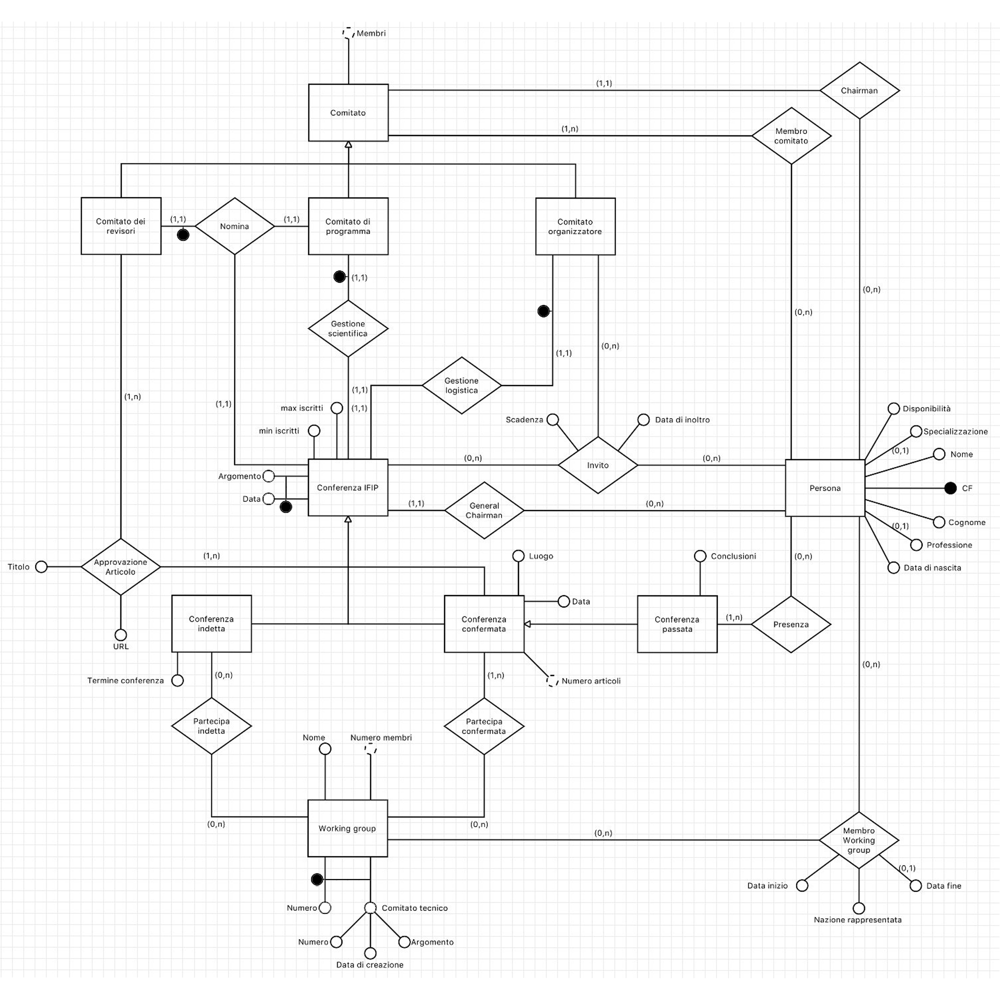

Un aspetto notabile del diagramma E-R è la suddivisione delle conferenze in tre stadi differenti e la rappresentazione tramite generalizzazione degli attributi e relazioni comuni a tutti gli stadi di conferenze. Tale suddivisione è necessaria al fine di rispettare alcuni requisiti, come la necessità per gli inviti di essere all'interno di un _range_ prestabilito, il che sarebbe difficile da rispettare se anche una conferenza appena indetta avesse questa restrizione.

Notiamo anche che ci sono diversi cicli da prendere in considerazione

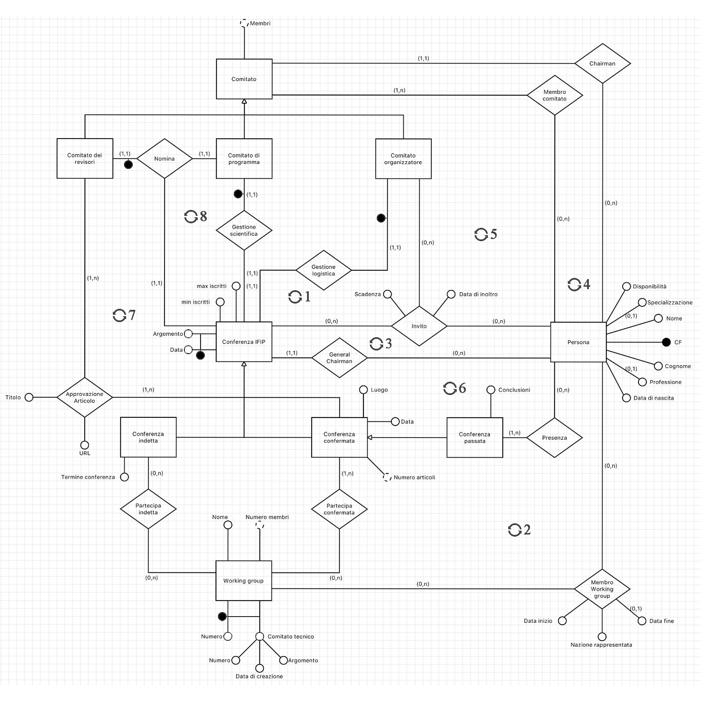

1. Il comitato organizzatore deve invitare esclusivamente alla conferenza che gestisce

2. Tutti i membri attivi di un Working Group che partecipa ad una data conferenza devono essere invitati alla stessa

3. Il general chairman deve essere invitato alla conferenza che gestisce

4. Il chairman di un comitato deve esserne un membro

5. Tutti i membri di un comitato assegnato ad una conferenza devono essere invitati alla stessa

6. Questo ciclo non evidenzia nessun vincolo aggiuntivo

7. Un articolo deve essere approvato per una conferenza dal comitato dei revisori ad essa assegnato

8. Il comitato di prgoramma deve nominare il comitato dei revisori per la stessa conferenza a cui è assegnato

# Progettazione logica

Lo scopo della progettazione logica è quello di giungere ad un modello relazionale. Prima di poterlo costruire, però, è fondamentale analizzare le ridondanze presenti nello schema E-R e determinare quali di esse vadano mantenute e quali scartate.

Preliminariamente alla progettazione logica è necessario avere però a disposizione le tabelle dei volumi e delle frequenze necessarie all'analisi delle ridondanze. Tali tabelle, non provvedute dalla consegna, sono popolate arbitrariamente cercando di mantenere verosimilità rispetto al dominio e tenendo conto degli ipotetici _use case_ del database

Seguono quindi le suddette:

## Tabella volumi

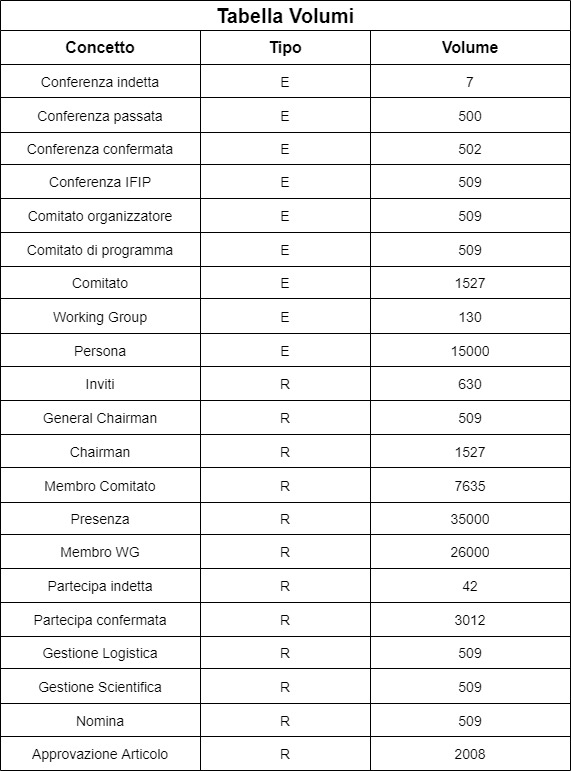

## Tabella frequenze

Per alcuni valori è stato ritenuto opportuno distinguere tra frequenza mediana e frequenza di picco in quanto alcune operazioni, sebbene raramente utilizzate, hanno picchi di utilizzo molto alti in specifiche circostanze

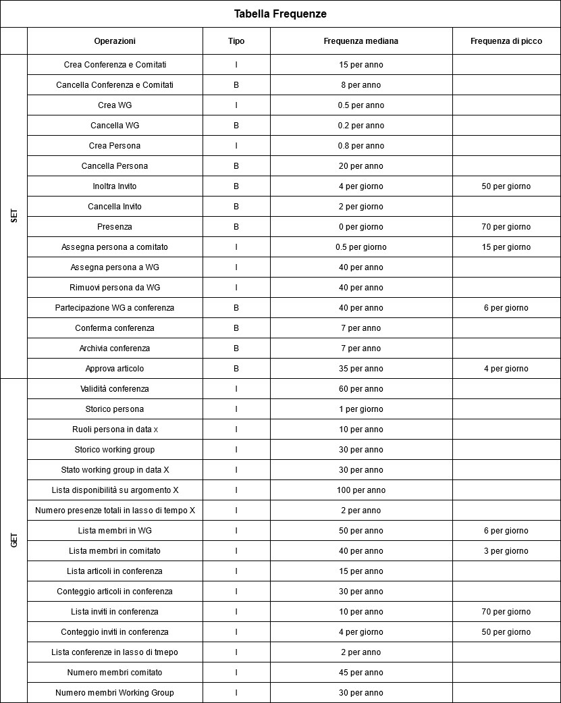

## Analisi delle ridondanze

Utilizzando le precedenti tabelle è stata analizzata la possibilità di utilizzare ridondanze per rappresentare alcuni dati, seguono i risultati:

* **Da mantenere:**
  - Il numero di membri in un working group
  - Il conteggio degli articoli approvati per la conferenza
  - Il numero di membri in un comitato

* **Da eliminare:**
  - Il numero di presenze in conferenze passate
  - La validità delle conferenza
  - Il conteggio degli inviti alla conferenza

Per brevità riportiamo il processo di analisi di solo uno di questi dati, in particolare il numero di membri in un comitato.

### Analisi numero di membri in un comitato:
Seguono le operazioni che interagiscono con il numero di membri in un comitato con la loro tabella degli accessi e frequenza di utilizzo, divise nei due casi: presenza e assenza di ridondanza.

#### Con ridondanza:

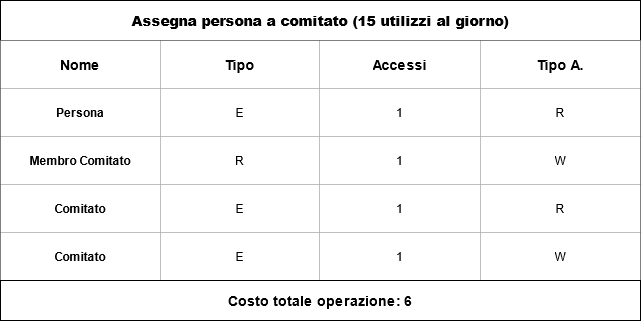

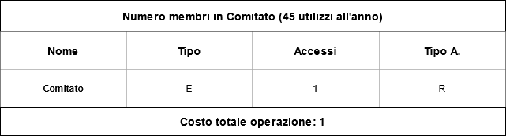

**Costo giornaliero totale: 90**

#### Senza ridondanza:

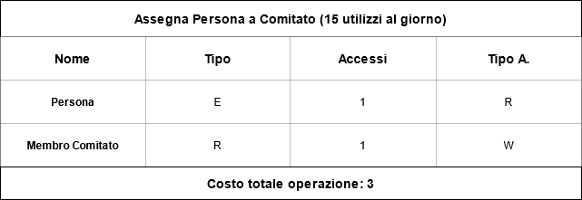

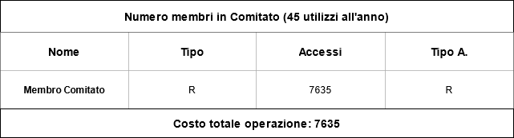

**Costo giornaliero totale: 961**

Come si evince dall’analisi, mantenere la ridondanza riduce gli accessi giornalieri di oltre 10 volte.

## Schema E-R ristrutturato

In preparazione allo sviluppo del modello relazionale è necessario ristrutturare significativamente lo schema E-R:

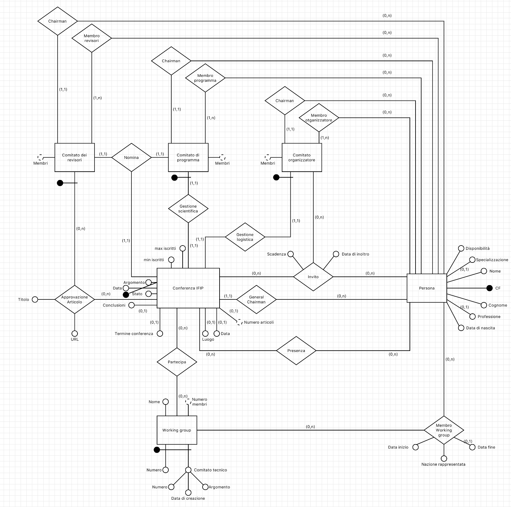

Oltre ad aver rimosso gli attributi ridondanti ritenuti non necessari durante l'analisi delle ridondanze è anche stata rimossa la generalizzazione delle conferenze e dei comitati.   

Per le conferenze è stato aggiunto l'attributo "Stato" alla conferenza il quale, con l'aiuto di alcune restrizioni aggiuntive, ricoprerà lo stesso ruolo della generalizzazione rimossa.

Per quanto riguarda i comitati, invece, è bastato semplicemente rimuovere l'entità generica e aggiungere le sue relazioni su ciascuno dei tipi di comitato individualmente

## Schema relazionale

Partendo dallo schema E-R opportunamente ristrutturato è stato sviluppato il seguente schema relazionale

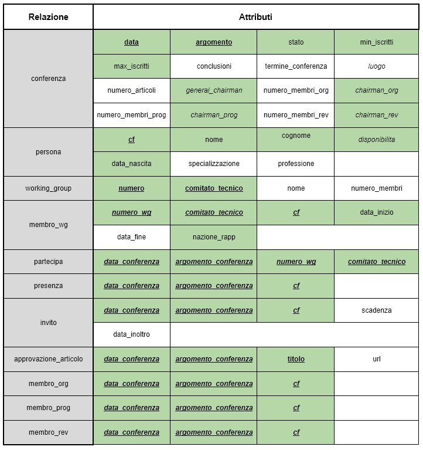

Nello schema sono evidenziate in verde gli attributi _not null_, sottolineate le _primary keys_ e in corsivo le _foreign keys_

# Progettazione fisica

Il linguaggio utilizzato per progettare fisicamente il database è Postresql, sono di seguito riportati alcuni frammenti di codice rilevanti.

Visto che le conferenze si distinguono in tre stati è stato ritenuto opportuno creare un tipo di dati dedicato.

```sql
CREATE TYPE STATO_CONFERENZA AS ENUM
(
'INDETTA', 'FISSATA', 'PASSATA'
);
```

La tabella centrale e più importante del database è "conferenza", qui sotto il codice per crearla.

```sql
CREATE TABLE conferenze.conferenza
(
  data date NOT NULL,
  argomento character varying(50) NOT NULL,
  stato stato_conferenza NOT NULL,
  min_iscritti smallint NOT NULL,
  max_iscritti smallint NOT NULL,
  conclusioni character varying(100),
  termine_conferenza date,
  luogo character varying(100),
  numero_articoli smallint DEFAULT 0,
  general_chairman character(16),
  numero_membri_org smallint DEFAULT 0,
  chairman_org character(16) NOT NULL,
  numero_membri_prog smallint DEFAULT 0,
  chairman_prog character(16) NOT NULL,
  numero_membri_rev smallint DEFAULT 0,
  chairman_rev character(16) NOT NULL,
  CONSTRAINT conferenza_pkey PRIMARY KEY (data, argomento),
  CONSTRAINT conferenza_chairman_org_fkey FOREIGN KEY (chairman_org, data, argomento)
  	REFERENCES conferenze.membro_org (cf, data_conferenza, argomento_conferenza) MATCH FULL
  	ON UPDATE CASCADE ON DELETE SET NULL
            DEFERRABLE INITIALLY DEFERRED,
  CONSTRAINT conferenza_chairman_prog_fkey FOREIGN KEY (chairman_prog, data, argomento)
  	REFERENCES conferenze.membro_prog (cf, data_conferenza, argomento_conferenza) MATCH FULL
  	ON UPDATE CASCADE ON DELETE SET NULL
            DEFERRABLE INITIALLY DEFERRED,
  CONSTRAINT conferenza_chairman_rev_fkey FOREIGN KEY (chairman_rev, data, argomento)
  	REFERENCES conferenze.membro_rev (cf, data_conferenza, argomento_conferenza) MATCH FULL
  	ON UPDATE CASCADE ON DELETE SET NULL
            DEFERRABLE INITIALLY DEFERRED,
  CONSTRAINT conferenza_general_chairman_fkey FOREIGN KEY (general_chairman)
  	REFERENCES conferenze.persona (cf) MATCH SIMPLE
  	ON UPDATE CASCADE ON DELETE SET NULL
            DEFERRABLE INITIALLY DEFERRED
);
```

La tabella necessita di diversi constraint aggiuntivi, sono mostrati quelli aggiunti per controllare la correttezza della conferenza in base al suo stato.

```sql
ALTER TABLE conferenze.conferenza
ADD CONSTRAINT controlla_indetta
CHECK (
  	termine_conferenza is not NULL
	OR stato != 'INDETTA'
);

ALTER TABLE conferenze.conferenza
ADD CONSTRAINT controlla_fissata
CHECK (
	(
    	data is not null
    	AND luogo is not null
    	AND ( min_iscritti <= conteggio_inviti(data, argomento))
    	AND (conteggio_inviti(data, argomento) <= max_iscritti )
    	AND (numero_articoli > 0)
	) OR stato != 'FISSATA'
);

ALTER TABLE conferenze.conferenza
ADD CONSTRAINT controlla_passata
CHECK (
	(
		conteggio_presenze(data, argomento) > 0
		AND conclusioni is not null
		AND luogo is not null
		AND data is not null
		AND numero_articoli > 0
	) OR stato != 'PASSATA'
);
```

Come si evince dal codice sopra riportato, il constraint "controlla_fissata" necessita della funzione "conteggio_inviti" che viene riportata qui sotto.   
Sono di seguito riportati, inoltre, i trigger utilizzati per mantenere l'attributo ridondante "numero_articoli", anche esso utilizzato nello stesso constraint.

```sql
CREATE OR REPLACE FUNCTION conteggio_inviti( data date, arg character varying(50) )
RETURNS smallint
LANGUAGE plpgsql AS
$$
	declare
		n smallint;
	begin
		select count(*) into n from conferenze.invito i
		where i.data_conferenza = data AND i.argomento_conferenza = arg;
		return n;
	end;
$$;
```

```sql
CREATE CONSTRAINT TRIGGER aggiunta_articolo
AFTER INSERT
ON conferenze.approvazione_articolo
DEFERRABLE
FOR EACH ROW
EXECUTE PROCEDURE aggiunto_articolo();

CREATE OR REPLACE FUNCTION aggiunto_articolo()
RETURNS trigger
LANGUAGE plpgsql AS
$$
	begin
		UPDATE conferenze.conferenza
		SET  numero_articoli =  numero_articoli + 1
		WHERE conferenza.data = new.data_conferenza
    AND conferenza.argomento = new.argomento_conferenza;

    return new;
	end;
$$;
```

# Implementazione

Sono stati generati tramite R dei dati casuali e semi-plausibili per popolare il database, sono riportati alcuni esempi notabili. Il codice mostrato in questa sezione non è quello originariamente usato (in quanto è andato perduto), ma è una ricostruzione apposita per dimostrare i concetti esplicati nella relazione.

### Tabella persona

Una delle prime e più semplici tabelle riempite è stata "persona". Nome e cognome sono estratti casualmente dal [file provveduto dal prof. Della Monica](https://users.dimi.uniud.it/~dario.dellamonica/teaching/19_20_1sem_BDlab/19_20_1sem_BDlab.php) mentre le specializzazioni vengono [dal documento sulle conferenze di Parigi nel 2020](https://networking.ifip.org/images/IFIP_Networking_2020-Booklet.pdf) a partire da pagina 17. Infine, le professioni sono tratte dall'articolo ["IT Jobs: Career Options, Job Titles, and Descriptions"](https://www.thebalancecareers.com/list-of-information-technology-it-job-titles-2061498) di Alison Doyle, scritto per [The Balance Careers](https://www.thebalancecareers.com/).

Per la data di nascita sono stati utilizzati interi casuali, rappresentativi di _time stamp_ unix, poi convertiti in date.

```r
Random_dates <- as.Date(as.POSIXct(sample(0:670204800, size=15000, replace=T), origin="1970-01-01"))
```

Per il codice fiscale si è usufruito di una libreria chiamata [ifc tools](https://cran.r-project.org/package=ifctools) come supporto, la quale genera un codice fiscale plausibile a partire da nome, cognome, sesso, data di nascita e codice catastale.

### Tabella conferenza

Per via della loro distinzione in tre stati con diverse caratteristiche, popolare la tabella "conferenza" è stato più complesso.

Cercando di simulare il ciclo di vita di una conferenza nel database, le conferenze sono inizialmente definite indette e in seguito convertite in fissate e passate in base alle date.

Tutte le conferenze, indipendentemente dallo stato, necessitano di un general chairman a loro assegnato. Per sceglierlo è stato semplicemente preso il primo invitato a ciascuna conferenza.

```r
Conf_join_inviti <- merge(Conferenze, Inviti, by.x = c("argomento", "data"), by.y = ("argomento_conferenza", "data_conferenza"))
Conf_join_inviti_unique <- Conf_join_inviti[!duplicated(Conf_join_inviti[c("argomento", "data")]),]
Conferenze$general_chairman <- Conf_join_inviti_unique$CF
```

In base alle date delle conferenze è stato quindi stabilito il loro stato per poi modificarle di conseguenza, aggiungendo il luogo alle conferenze fissate e luogo, almeno un articolo e conclusioni a quelle passate.

```r
Indette <- Conferenze$data_scadenza > Sys.Date()
Passate <- Conferenze$data < Sys.Date()
Fissate <- !Indette & !Passate

Conferenze$luogo[Passate | Fissate] <- sample(Luoghi, size=550, replace=T)
```

# Analisi database

Per l'analisi dati sono stati utilizzati 4 grafici diversi: boxplot, histogram, barplot e heatmap.

Prima di poter realizzare i grafici è necessario però connettersi al database:

```r
library("RPostgreSQL")
drv <- dbDriver("PostgreSQL")
con <- dbConnect(drv, dbname="conferenze",
                 host="127.0.0.1", port=5432, user="postgres", password="postgres")
```

## Boxplot

Il boxplot rappresenta la quantità di articoli per ogni conferenza già passata:

```r
numero_articoli_passate <- dbGetQuery(con, "SELECT numero_articoli
                                            FROM conferenze.conferenza
                                            WHERE stato='PASSATA'")
```

```r
grafico_articoli <- boxplot(
                            numero_articoli_passate$numero_articoli,
                            horizontal = T,
                            xlab = "Frequency",
                            col = "yellow"
                            )
```

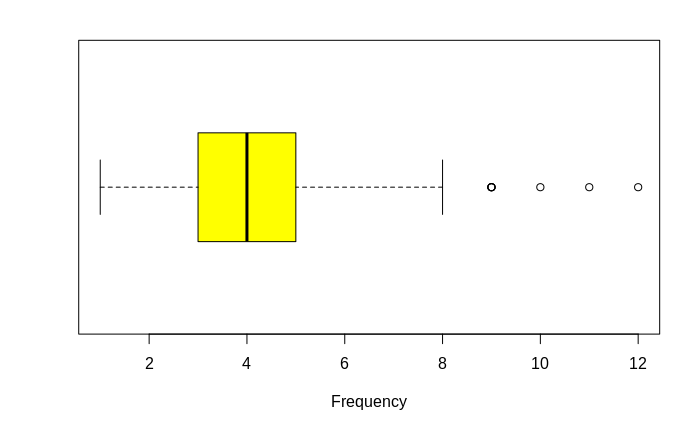

## Histogram

L'istogramma raffigura gli anni di nascita di tutti i Network Administrator presenti nel database:

```r
network_administrator <- dbGetQuery(con, "SELECT data_nascita
                                          FROM conferenze.persona
                                          WHERE professione='Network Administrator'")
```

Una volta eseguito il query si scartano giorno e mese dalle date per una visualizzazione delle didascalie più pulita

```r
a <- format(as.Date(network_administrator$data_nascita,format="%d/%m/%Y"), "%Y")
a <- as.numeric(a)
hist(
    a,
    breaks = 20,
    col = rgb(0.2,0.8,0.5,0.5),
    border = F,
    freq = T,
    xlim = c(1970,1991),
    las=1,
    xlab = "Birth Dates",
    main = ""
    )
```

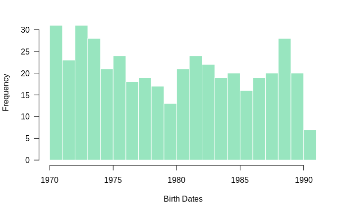

## Barplot

Il barplot è invece utilizzato per mostrare la quantità di professionisti in ciascuna disciplina all'interno di uno specifico Working Group (in questo caso WG-1.1):

```r
job_in_wg <- dbGetQuery(con, "SELECT persona.professione
                              FROM conferenze.persona LEFT JOIN conferenze.membro_wg
                                                      ON persona.cf = membro_wg.cf
                              WHERE membro_wg.numero_wg = 1 AND membro_wg.comitato_tecnico = 1")
```

```r
par(mar=c(2,9,0,1))
barplot(
        table(job_in_wg$professione),
        horiz = T,
        las=1,
        cex.names = 0.6,
        col = "#87CEFA"
        )
```

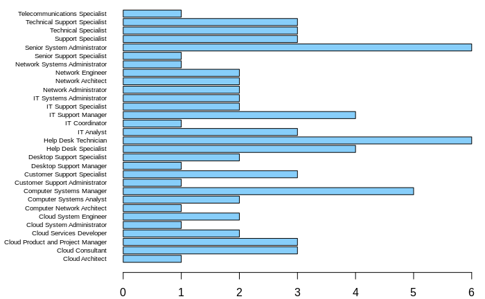

## Heatmap

L'heatmap qui rappresenta le distribuzioni di professioni e specializzazioni all'interno di uno specifico Working Group (in questo caso WG-2.5):

```r
prof_spec <- dbGetQuery(con, "SELECT persona.professione, persona.specializzazione
                              FROM conferenze.persona LEFT JOIN conferenze.membro_wg
                                                      ON persona.cf = membro_wg.cf
                              WHERE membro_wg.numero_wg = 5 AND membro_wg.comitato_tecnico = 2")

```

Una volta eseguito il query il risultato viene utilizzato per riempire una matrice le cui dimensioni sono rispettivamente professione e specializzazione e dove il valore di ciascuna cella rappresenta quante persone abbiano la corrispondente combinazione di professione e specializzazione:

```r
unique_prof <- unique(prof_spec$professione)
unique_spec <- unique(prof_spec$specializzazione)
m <- matrix(0, nrow = length(unique_prof) ,length(unique_spec))
colnames(m) <- unique_spec
rownames(m) <- unique_prof
for (i in 1:length(prof_spec$professione)) {
  m[prof_spec$professione[i],prof_spec$specializzazione[i]] = m[prof_spec$professione[i],prof_spec$specializzazione[i]]+1
}
```

Infine la matrice generata viene utilizzata per realizzare la heatmap:

```r
heatmap(
        m,
        Rowv = NA,
        Colv = NA,
        col= rev(heat.colors(3)),
        cexCol = 0.8,
        cexRow = 0.7,
        margins = c(10,3)
        )

legend(
      x=0,
      y=1,
      legend = c(0, 1, 2),
      fill = colorRampPalette(rev(heat.colors(3)))(3)
      )
```


